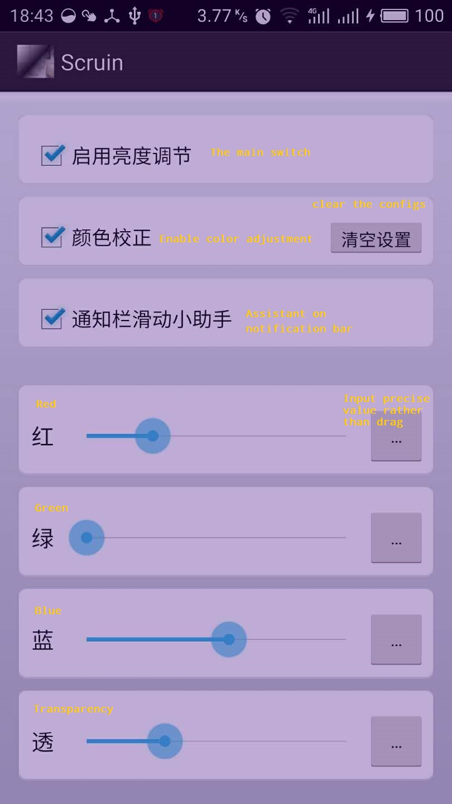

---

# [scruin](https://git.oschina.net/ssqston/scruin.git)

----

Note: ** For android users only. **

If you are used to working with your android device at late night with faint or event no light in the background, this app is tailored for you to get rid of the dilemma that whether to drop your work at hand or to endure the strong light continuously emitting from the phone screen even you have turned the light strength to zero. Actually, the screen will eventually ruin your sight abilities, unless you adopt this app -- **scruin**. 

This app works by adding an additional layer upon all your applications, whose color and transparency can be configured by yourself. And this layer will not hinder your touch actions. 

Moreover, you can use this app to adjust your screen color, just change the color component r, g and b of the layer, and you can somehow change the color temperature of the display. 

To change the transparency without bothering to open the configure Activity, just enable the option "Assistant on notification bar", and you can adjust the transparency of the layer by long pressing on the notification bar, and drag your finger along the notification bar. 

